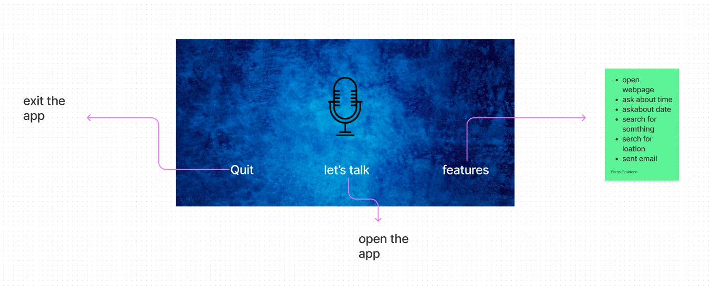
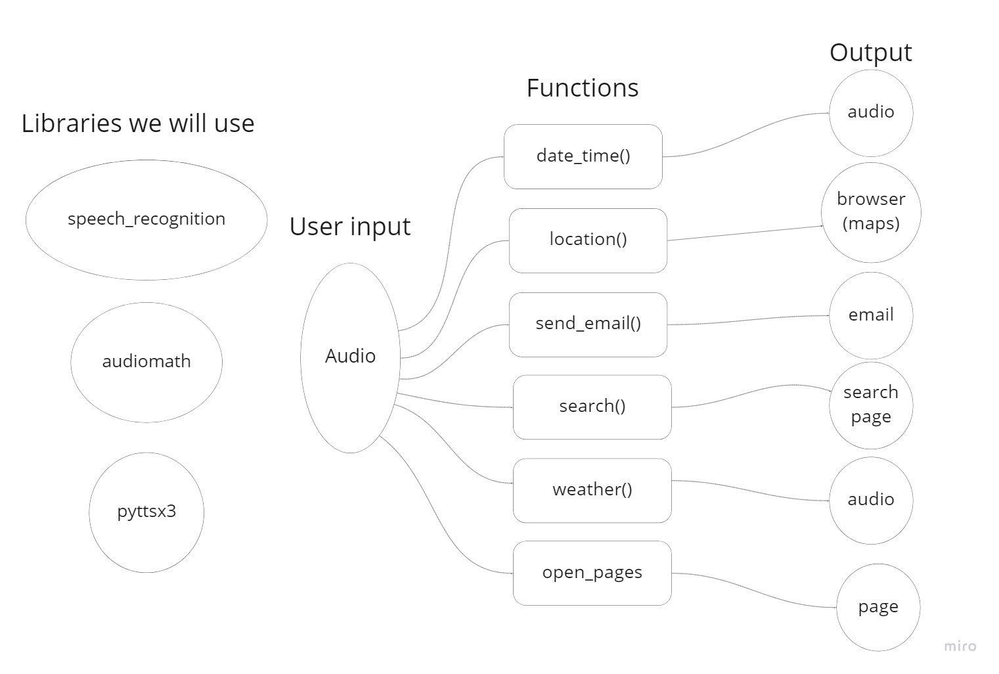

## Dario voice assistant

problem to solve:
It will produce a new way for communicate between the user and the machine instead of the old ways which he had to use the mouse and the keyboard to command the machine

It will provide the user the ability to command the machine to do some work for him by voice instead of ordinary ways.

minimum features for the presentation :

- Ask about the date and time 
- Send emails 
- Open webpages 
- Ask about the weather 
- Ask about locations 

Stretch Goals:

- Open applications
- Set alarm
- Play music

## User Stories:

### user storis#1

#### Title
search about somthing
#### User Story sentence
as a user I want to be able to search using my voice so that I dont need to write every thing I want to search for

#### Feature Tasks
the user can command the machine to search for him
#### Acceptance Tests

GIVEN: the user has pressed the mic icon
WHEN: The user asks to search and then says what he want to search for.
THEN: the application open a google page have the topic that the user want to search for

### user storis#2

#### Title
ask about time 
#### User Story sentence
as a user I want to be able to know the time just by asking the machine about it
#### Feature Tasks
the user can command the machine to tell him the time
#### Acceptance Tests
GIVEN: the user has pressed the mic icon

WHEN: The user asks the machine for the time

THEN: the application ill say the exact time

### user storis#3
#### Title
search about location
#### User Story sentence
As a user I want to search about location of any city so I can know exactlly the correct location whithout opening any app or typing anything
#### Feature Tasks
the user can command the machine to tell him the time
#### Acceptance Tests
GIVEN: the user has pressed the mic icon

WHEN: the user asks for the location an the provide the ame of the location

THEN: the application displays the city location using the browser

### user storis#4
#### Title
send email
#### User Story sentence
as a user I want to send email so this can help me to send it fastly without typing
#### Feature Tasks
the user can command the machine to tell him the time
#### Acceptance Tests
GIVEN: you need to press on the mic icon

WHEN: the user asks to snt email then provide the massage and the email of the reciver 

THEN: the application send the email and says the email sended

### user storis#5
#### Title
ask about python 
#### User Story sentence
As a user, I want to search for instructions in the Python programming language so that I can get results through voice commands without resorting to traditional methods.
#### Feature Tasks
the user can command the machine to give him nstuctions about some python topics
#### Acceptance Tests
Give: press the microphone icon

When: the user asks for instructions in the Python programming language.

Then: the application will open a website where the instructions that he asked about are presented to him.

### user storis#6
#### Title
ask about weather
#### User Story sentence
 As a user I would like to know the temperature of the day for a specific city after asking the assistant to search for it.
#### Feature Tasks
the user can command the machine to give weather feedback
#### Acceptance Tests
Given: The user pressed on the mic icon.

When: The user asks for weather and provides the city name after that.

Then: Dario assistant will be able to say the exact weather temperature of the day.

# WireFrame :

# Domain Modeling

# trello

[trello](https://trello.com/b/BkLfXBc2/dario-voice-assistant)